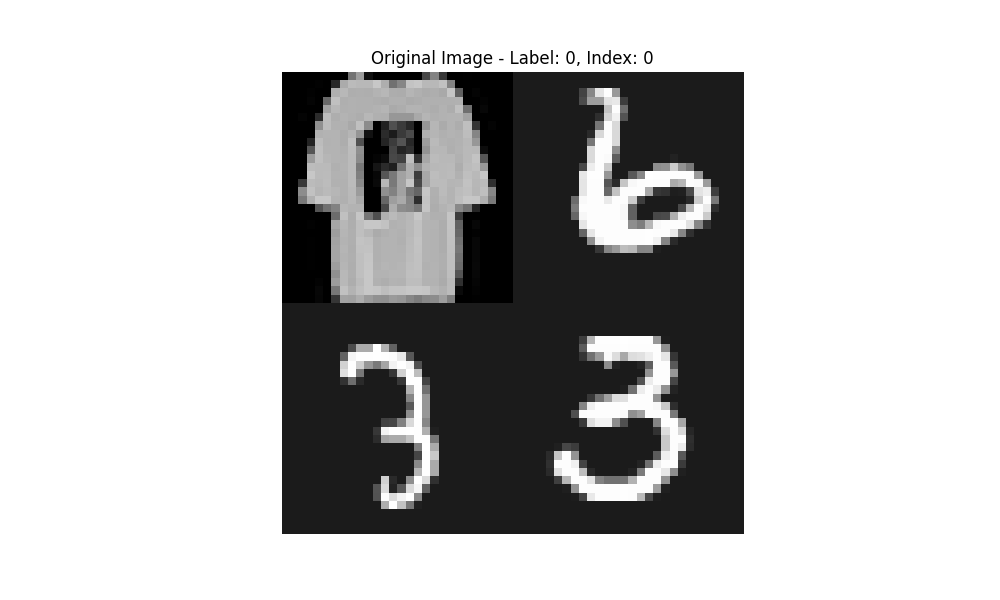
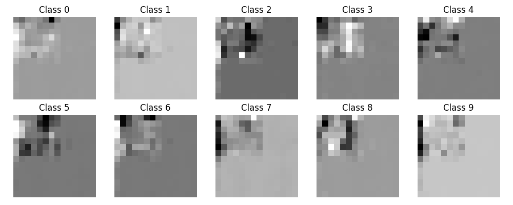

# Activation Map Visualization

## Overview
This project investigates the visualization of activation maps in a convolutional neural network (CNN) to understand which parts of an input image contribute most to the classification decision. A custom dataset combining Fashion-MNIST and MNIST images in a 2x2 grid is used. The network architecture includes a Global Average Pooling (GAP) layer replaced by a 1x1 convolution during visualization to generate class activation maps.

## Dataset
- **Custom Grid Dataset**: Each image is a 2x2 grid with:
  - 1 Fashion-MNIST image (random position).
  - 3 MNIST images (randomly chosen).
- **Purpose**: The model learns to focus on the Fashion-MNIST image for classification.

## Model Architecture
The CNN (`self.base` module) consists of:
1. **Conv2d** (1→32 channels, kernel=3, padding=1) → ReLU → MaxPool2d (2x2).
2. **Conv2d** (32→64 channels, kernel=3, padding=1) → ReLU → MaxPool2d (2x2).
3. **Conv2d** (64→128 channels, kernel=3, padding=1) → ReLU.
4. **GAP Layer** → Linear layer (128→10 classes).

For visualization, GAP and linear layers are replaced by a **1x1 Conv2d layer** using transferred weights.

## Training Details
- **Optimizer**: Adam (learning rate=0.001).
- **Batch Size**: 64.
- **Epochs**: 10.
- **Loss Function**: Cross-Entropy Loss.
- **Test Accuracy**: Achieved **>80%** accuracy on the test set.

## Results
- **Activation Maps**: Highlight the Fashion-MNIST image's position for the correct class.
- **Example Visualization**: 
  - Original image with correct label.
  - Activation maps for all 10 classes (higher activation at Fashion-MNIST location for the true class).

## Running the Code
### Dependencies
- PyTorch, torchvision, numpy, matplotlib, tqdm.

### Instructions
1. **Train & Evaluate**:
   - Run `main.py` to train the model and evaluate on the test set.
   - Model weights are transferred automatically for visualization.
2. **Visualization**:
   - A correctly classified test image is selected.
   - Outputs:
     - `original_image.png`: Input image with label.
     - `activation_map.png`: Activation heatmaps for each class.
3. **Model Summary**:
   - Printed after training, showing layer details.

## Example Output

